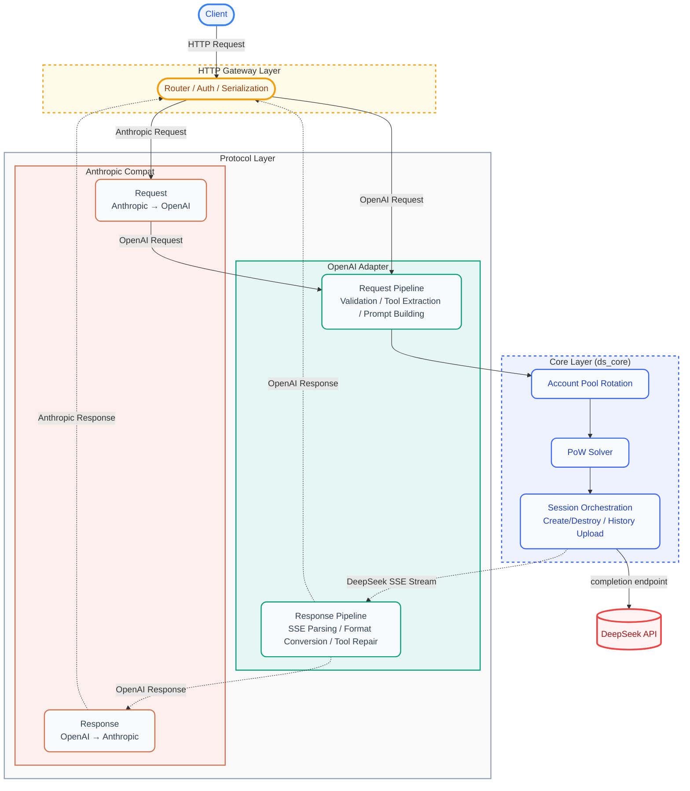
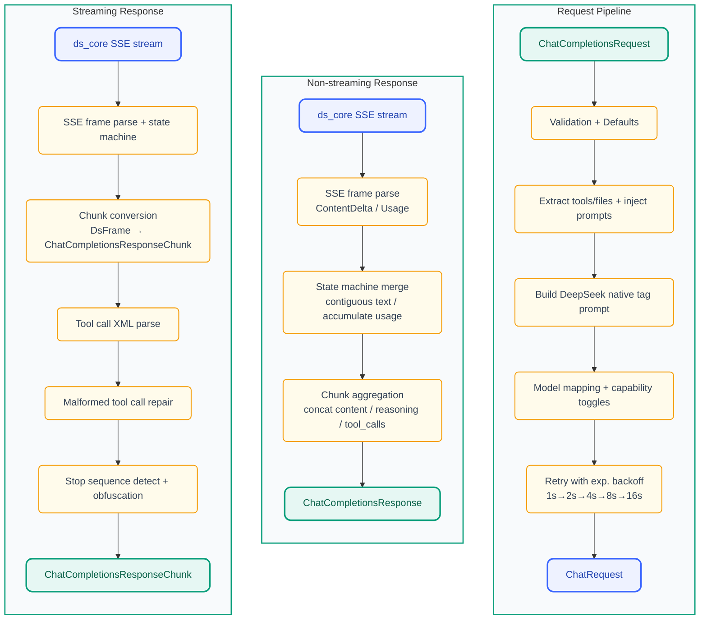
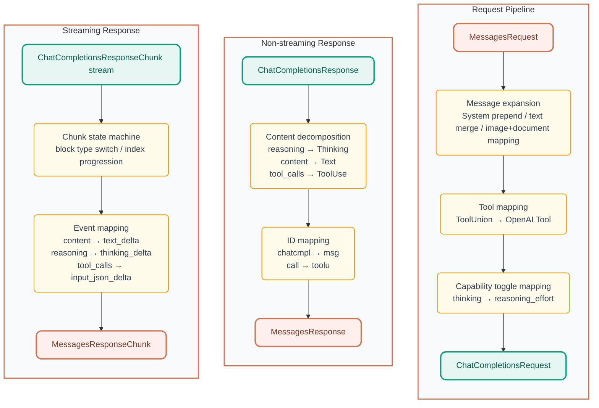

<p align="center">
  
</p>

<h1 align="center">DS-Free-API</h1>

<p align="center">
  <a href="LICENSE"></a>
  
  
  
</p>
<p align="center">
  
  
  
</p>

[中文](README.md)

A Rust API proxy that translates DeepSeek's free web chat into standard OpenAI and Anthropic-compatible API protocols (supports chat completions and messages, including streaming and tool calling).

## Highlights

- **Zero-cost API proxy**: Uses DeepSeek's free web interface — no official API key needed, get OpenAI/Anthropic-compatible endpoints for free
- **Dual protocol support**: Both OpenAI Chat Completions and Anthropic Messages API, drop-in compatible with mainstream clients
- **Tool call ready**: Full OpenAI function calling implementation with a 3-tier self-healing pipeline (text repair → JSON repair → model fallback), covering 10+ malformed formats
- **File upload ready**: Inline data URL files in OpenAI `file`/`image_url` content parts and Anthropic `image`/`document` content blocks are automatically uploaded to DeepSeek sessions; HTTP URLs trigger search mode so the model can access link content directly
- **Web admin panel**: Built-in dashboard for account pool status, API key management, request logs, and hot-reloadable config — ready out of the box
- **Built with Rust**: Single binary + single TOML config, cross-platform native performance (web panel compiled in at build time)
- **Multi-account pool**: Idle-aware round-robin selection (DashMap lock-free reads), horizontal scaling for concurrency

## Quick Start

### Binary Usage

1. Download and extract the archive for your platform from [releases](https://github.com/NIyueeE/ds-free-api/releases)
2. Copy `config.example.toml` to `config.toml` and fill in accounts (optional — you can also configure via the admin panel after startup)
3. Run `./ds-free-api`
4. Visit `http://127.0.0.1:22217/admin` to set an admin password, then manage API keys and accounts from the panel

```bash
./ds-free-api
./ds-free-api -c /path/to/config.toml
RUST_LOG=debug ./ds-free-api
```

> **Concurrency**: The free API has session-level rate limits. This project has built-in rate-limit detection + exponential backoff retry for stability.
> Recommended parallelism = accounts / 2. Supports starting without `config.toml` and adding accounts via the admin panel.

### Docker Usage

```bash
docker compose -f docker-compose.yaml up -d
```

Refer to the [sample compose file](./docker/docker-compose.yaml) for reference.

The admin panel is at `http://localhost:22217/admin`. Set your admin password on first visit.
The `config/` and `data/` directories are bind-mounted into the container — config changes persist to the host automatically.

### Free Test Accounts

All accounts use password `test12345`:

```text
debatefeatgdcdve+mclendon@gmail.com
t.a.ya.hs.c.h.war.z2.5.7@gmail.com
vsigsiehvdidod+hewitt@gmail.com
sks.j.hsms.h.sms.n.bv@gmail.com
slsnvskshevvekeb+berg@gmail.com
v.s.i.gs.i.ehv.di.d.o.d@gmail.com
slsnvskshevvekeb+christie@gmail.com
wa.sh.brom.a.i.1.9.1@gmail.com
```

> 💡 Use [emailtick.com](https://www.emailtick.com/en) to quickly create unlimited temporary Gmail accounts.
> When test accounts get banned, register new ones and replace them.
> From [issue #62](https://github.com/NIyueeE/ds-free-api/issues/62)


## API Endpoints

| Method | Path | Description |
|--------|------|-------------|
| GET    | `/`   | Redirect to admin panel |
| GET    | `/health` | Health check |
| POST   | `/v1/chat/completions` | Chat completions (streaming + tool calls) |
| GET    | `/v1/models` | List models |
| GET    | `/v1/models/{id}` | Model details |
| POST   | `/anthropic/v1/messages` | Anthropic Messages (streaming + tool calls) |
| GET    | `/anthropic/v1/models` | List models (Anthropic format) |
| GET    | `/anthropic/v1/models/{id}` | Model details (Anthropic format) |

The admin panel is at `/admin` — on first visit you'll be guided to set an admin password.

## Model Mapping

The `model_types` config in `config.toml` (default `["default", "expert"]`) maps to model IDs:

| OpenAI Model ID    | DeepSeek Mode  |
| ------------------ | -------------- |
| `deepseek-default` | Fast mode      |
| `deepseek-expert`  | Expert mode    |

Optional aliases via `model_aliases`, aligned by index with `model_types`. Empty strings are skipped:

```toml
# model_aliases = ["", "deepseek-v4-pro"]  → deepseek-v4-pro maps to expert (index 1)
model_aliases = []
```

The Anthropic compatibility layer uses the same model IDs via `/anthropic/v1/messages`.

### Capability Toggles

- **Deep thinking**: Enabled by default. To explicitly disable, include `"reasoning_effort": "none"` in the request body.
- **Web search**: Enabled by default (DeepSeek injects a stronger system prompt in search mode, improving tool call adherence). To explicitly disable, include `"web_search_options": {"search_context_size": "none"}` in the request body.
- **File upload**: Inline files (data URL) are auto-uploaded to DeepSeek sessions; HTTP URLs trigger search mode:

  **OpenAI endpoint:**
  ```json
  {"type": "file", "file": {"file_data": "data:text/plain;base64,...", "filename": "doc.txt"}}
  {"type": "image_url", "image_url": {"url": "data:image/png;base64,..."}}
  {"type": "image_url", "image_url": {"url": "https://example.com/img.jpg"}}
  ```

  **Anthropic endpoint:**
  ```json
  {"type": "image", "source": {"type": "base64", "media_type": "image/png", "data": "..."}}
  {"type": "document", "source": {"type": "base64", "media_type": "text/plain", "data": "..."}}
  {"type": "image", "source": {"type": "url", "url": "https://example.com/img.jpg"}}
  ```

### Tool Call Tag Hallucination

Built-in fuzzy matching handles variations (full-width `｜`<=>`|`, `▁`<=>`_`) for most formats. If the model outputs a different fallback tag, add it via the admin panel or in `config.toml` under `[deepseek]`:

```toml
tool_call.extra_starts = ["<|tool_call_begin|>", "<tool_calls>", "<tool_call>"]
tool_call.extra_ends = ["<|tool_call_end|>", "</tool_calls>", "</tool_call>"]
```

## Web Admin Panel

Visit `http://127.0.0.1:22217/admin` after starting the server:

- **Dashboard**: Request statistics, account pool status at a glance
- **Accounts**: View/add/remove accounts, manually re-login accounts in Error state
- **API Keys**: Create/delete API keys, masked display
- **Models**: Available models with details
- **Config**: Current runtime config (sensitive fields masked)
- **Logs**: Recent request logs and runtime logs

<p align="center">
  
  <br>
  <em>Dashboard overview</em>
</p>

<p align="center">
  
  <br>
  <em>Config editor page</em>
</p>

On first visit, you'll be guided to set an admin password (stored as bcrypt hash), then issued a JWT (24h validity). Password reset revokes old tokens.

## Environment Variables

| Variable | Default | Description |
|----------|---------|-------------|
| `RUST_LOG` | `info` | Log level (`trace` / `debug` / `info` / `warn` / `error`) |
| `DS_DATA_DIR` | `.` (current dir) | Data directory for `logs/runtime.log` and `stats.json` |
| `DS_CONFIG_PATH` | `./config.toml` | Config file path (lower priority than `-c` flag) |

## Security

- **Admin panel**: JWT authentication + bcrypt password hash + login rate limiting (5 failures → 5-minute lockout)
- **API access**: API keys created via the admin panel (HashSet O(1) lookup)
- **CORS**: Configurable allowed origins, defaults to `http://localhost:22217`
- **Sensitive data**: Account IDs masked in response headers, request bodies excluded from logs, persisted files at 0600 permissions

## Development

### Design Philosophy

**A single `config.toml` reflects all runtime state.** Admin panel changes are instantly persisted to `config.toml` and hot-reloaded into the running service.

**No unnecessary runtime system dependencies.** The project prioritizes pure Rust or statically-linked dependencies (e.g., `rustls` → `wreq` with BoringSSL), ensuring a single binary with no external `.so`/`.dll` requirements — download and run.

### Architecture Diagram



### Data Pipeline

#### OpenAI (chat_completions) Pipeline:



#### Anthropic (messages) Pipeline:



For detailed development guide (building, testing, Docker deployment, e2e testing, etc.), see [docs/en/development.md](./docs/en/development.md).

## License

[GNU General Public License v3.0](LICENSE)

[DeepSeek's official API](https://platform.deepseek.com/top_up) is very affordable — please support the official service.

This project was born from the desire to try the latest models in DeepSeek's web interface during grayscale testing.

**Commercial use is strictly prohibited** to avoid putting pressure on official servers. Use at your own risk.
