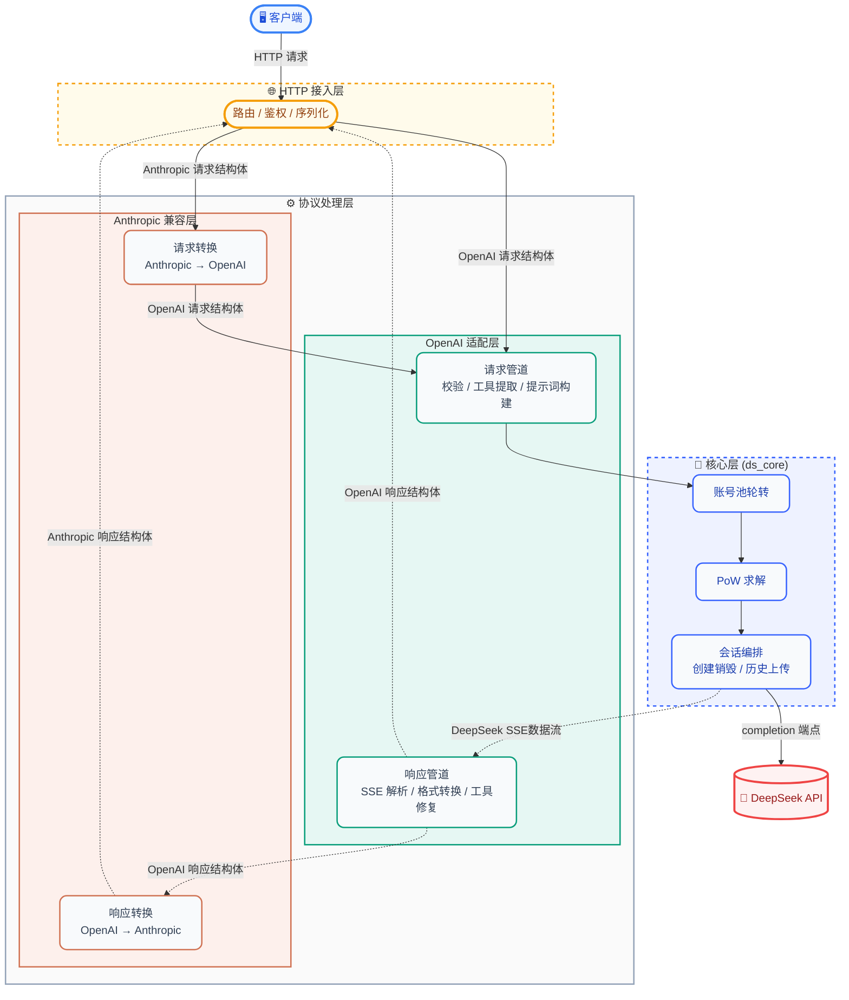
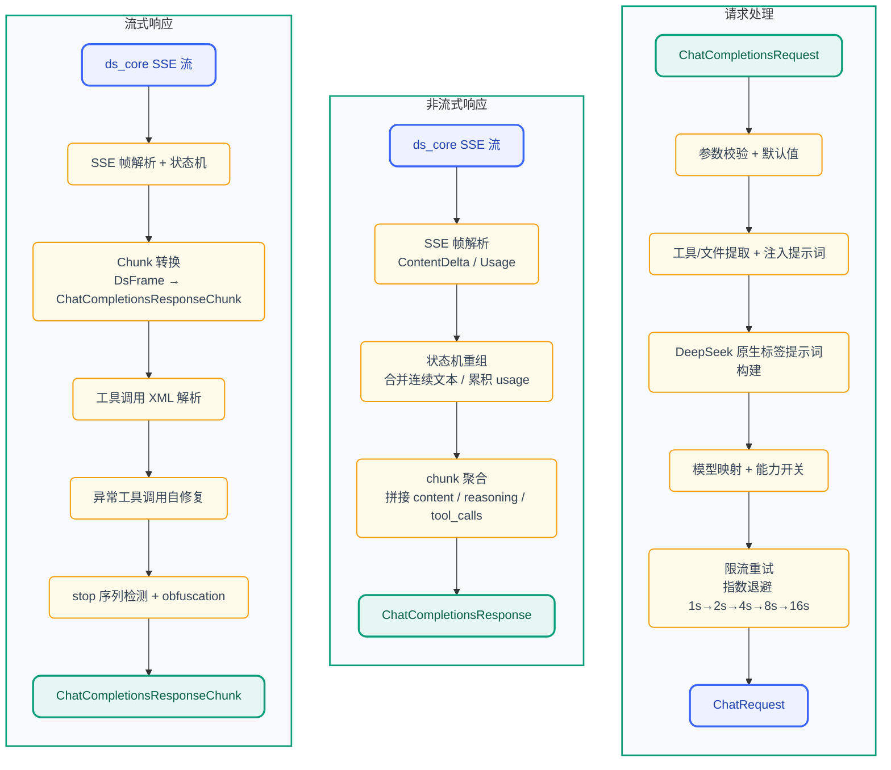
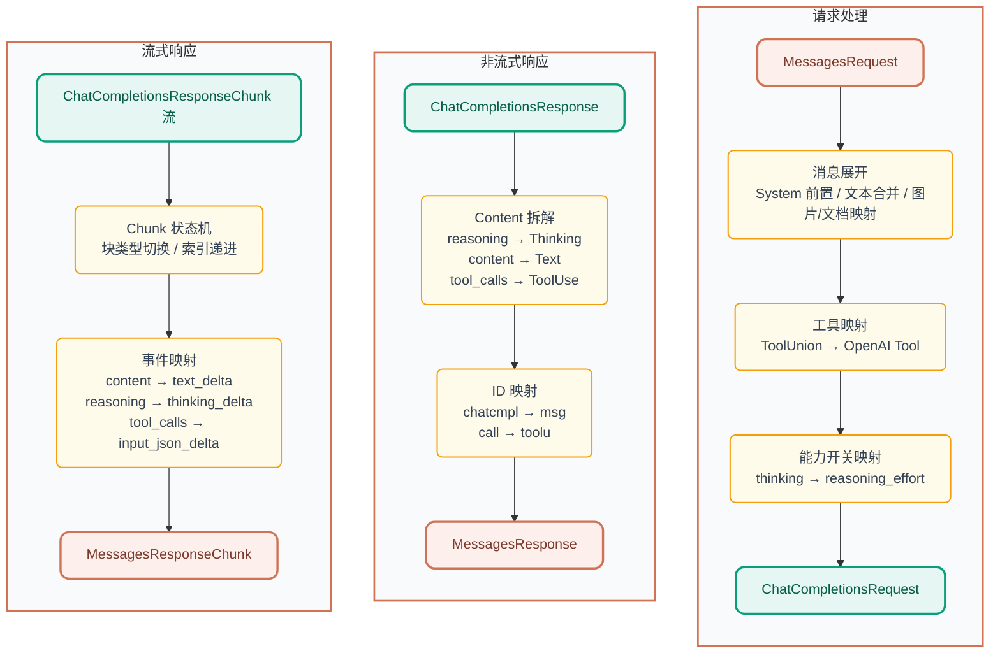

<p align="center">
  
</p>

<h1 align="center">DS-Free-API</h1>

<p align="center">
  <a href="LICENSE"></a>
  
  
  
</p>
<p align="center">
  
  
  
</p>

[English](README.en.md)

将免费的 DeepSeek 网页端对话反代并适配转换为标准的 OpenAI 与 Anthropic 兼容 API 协议（目前支持 chat completions 和 messages，包括流式返回与工具调用）。

## 项目亮点

- **零成本 API 代理**：使用 DeepSeek 免费网页端，无需官方 API Key，即可获得 OpenAI / Anthropic 兼容接口
- **双协议支持**：同时兼容 OpenAI Chat Completions 与 Anthropic Messages API，主流客户端即插即用
- **工具调用就绪**：OpenAI function calling 完整实现，工具解析 + 三层自修复管道（文本修复 → JSON 修复 → 模型兜底），覆盖 10+ 异常格式
- **文件上传就绪**：支持 OpenAI `file` / `image_url` content part 和 Anthropic `image` / `document` content block 的内联 data URL 文件自动上传到 DeepSeek 会话；
  HTTP URL 自动触发搜索模式，模型可直接访问链接内容
- **Web 管理面板**：内置可视化面板，账号池状态、API Key 管理、请求日志、配置热重载，开箱即用
- **Rust 实现**：单可执行文件 + 单 TOML 配置，跨平台原生高性能（Web 面板编译时嵌入，开箱即用）
- **多账号池**：空闲最久优先轮转（DashMap 无锁读），支持水平扩展并发

## 快速开始

### 二进制使用

1. 从 [releases](https://github.com/NIyueeE/ds-free-api/releases) 下载对应平台压缩包并解压
2. 复制 `config.example.toml` 为 `config.toml` 并填入账号 (可选, 也可启动后在管理面板中配置)
3. 运行 `./ds-free-api`
4. 访问 `http://127.0.0.1:22217/admin` 设置管理密码，之后可在面板中创建 API Key 和管理账号

```bash
./ds-free-api
./ds-free-api -c /path/to/config.toml
RUST_LOG=debug ./ds-free-api
```

> **并发**：免费 API 有 session 级速率限制。本项目内置限流检测 + 指数退避重试，确保稳定。
> 推荐并行数 = 账号数 / 2。支持无 config.toml 启动后通过管理面板添加账号。

### Docker 使用

```bash
docker compose -f docker-compose.yaml up -d
```

可以参考[示例compose文件](./docker/docker-compose.yaml)

管理面板在 `http://localhost:22217/admin`，首次访问设置管理密码。
`config/` 和 `data/` 目录通过 bind mount 挂载到容器内，配置修改自动持久化到宿主机。

### 免费测试账号

以下账号密码统一为 `test12345`：

```text
debatefeatgdcdve+mclendon@gmail.com
t.a.ya.hs.c.h.war.z2.5.7@gmail.com
vsigsiehvdidod+hewitt@gmail.com
sks.j.hsms.h.sms.n.bv@gmail.com
slsnvskshevvekeb+berg@gmail.com
v.s.i.gs.i.ehv.di.d.o.d@gmail.com
slsnvskshevvekeb+christie@gmail.com
wa.sh.brom.a.i.1.9.1@gmail.com
```

> 💡 使用 [emailtick.com](https://www.emailtick.com/zh) 可快速创建无限数量的 Gmail 临时账号；
> 测试账号被封后可自行注册替换。
> 来自[issue #62](https://github.com/NIyueeE/ds-free-api/issues/62)

## API 端点

| 方法 | 路径 | 说明 |
|------|------|------|
| GET  | `/`   | 重定向到管理面板 |
| GET  | `/health` | 健康检查 |
| POST | `/v1/chat/completions` | 聊天补全（支持流式与工具调用） |
| GET  | `/v1/models` | 模型列表 |
| GET  | `/v1/models/{id}` | 模型详情 |
| POST | `/anthropic/v1/messages` | Anthropic Messages（支持流式与工具调用） |
| GET  | `/anthropic/v1/models` | 模型列表（Anthropic 格式） |
| GET  | `/anthropic/v1/models/{id}` | 模型详情（Anthropic 格式） |

管理面板位于 `/admin`，首次访问引导设置管理密码。
## 模型映射

`config.toml` 中 `model_types`（默认 `["default", "expert"]`）自动映射：

| OpenAI 模型 ID     | DeepSeek 类型 |
| ------------------ | ------------- |
| `deepseek-default` | 快速模式      |
| `deepseek-expert`  | 专家模式      |

可选别名通过 `model_aliases` 按 index 对齐 `model_types`，默认无别名。空字符串被跳过：

```toml
# model_aliases = ["", "deepseek-v4-pro"]  → deepseek-v4-pro 映射到 expert（index 1）
model_aliases = []
```
Anthropic 兼容层使用相同的模型 ID，通过 `/anthropic/v1/messages` 调用。

### 能力开关

- **深度思考**：默认已开启。如需显式关闭，请求体中加 `"reasoning_effort": "none"`。
- **智能搜索**：默认已开启（DeepSeek 后端在搜索模式下会注入更强的系统提示词，提升工具调用遵循度）。如需显式关闭，请求体 中加 `"web_search_options": {"search_context_size": "none"}`。
- **文件上传**：支持内联文件（data URL）自动上传到 DeepSeek 会话，以及 HTTP URL 自动触发搜索模式：

  **OpenAI 端：**
  ```json
  {"type": "file", "file": {"file_data": "data:text/plain;base64,...", "filename": "doc.txt"}}
  {"type": "image_url", "image_url": {"url": "data:image/png;base64,..."}}
  {"type": "image_url", "image_url": {"url": "https://example.com/img.jpg"}}  {" "}
  ```

  **Anthropic 端：**
  ```json
  {"type": "image", "source": {"type": "base64", "media_type": "image/png", "data": "..."}}
  {"type": "document", "source": {"type": "base64", "media_type": "text/plain", "data": "..."}}
  {"type": "image", "source": {"type": "url", "url": "https://example.com/img.jpg"}}
  ```

### 工具调用标签幻觉

内置模糊匹配（全角 `｜`<=>`|`、`▁`<=>`_`），自动覆盖大多数变体。若模型输出格式不同的回退标签，可在控制面板中添加, 或者在 `config.toml` 的 `[deepseek]` 下追加：

```toml
tool_call.extra_starts = ["<|tool_call_begin|>", "<tool_calls>", "<tool_call>"]
tool_call.extra_ends = ["<|tool_call_end|>", "</tool_calls>", "</tool_call>"]
```

## Web 管理面板

启动服务后访问 `http://127.0.0.1:22217/admin` 即可进入管理面板：

- **概览**：请求统计、账号池状态一览
- **账号池**：查看/添加/移除账号，手动重新登录 Error 状态账号
- **API Keys**：创建/删除 API Key，脱敏展示
- **模型**：可用模型列表与详情
- **配置**：当前运行配置（脱敏）
- **日志**：最近请求日志与运行时日志

<p align="center">
  
  <br>
  <em>管理面板概览（Dashboard）</em>
</p>

<p align="center">
  
  <br>
  <em>配置界面（Config）</em>
</p>

首次访问时引导设置管理密码（bcrypt 哈希存储），登录后签发 JWT（24h 有效），支持密码重置时吊销旧 Token。

## 环境变量

| 变量 | 默认值 | 说明 |
|------|--------|------|
| `RUST_LOG` | `info` | 日志级别（`trace` / `debug` / `info` / `warn` / `error`） |
| `DS_DATA_DIR` | `.`（当前目录） | 数据目录，存放 `logs/runtime.log` 和 `stats.json` |
| `DS_CONFIG_PATH` | `./config.toml` | 配置文件路径，优先级低于 `-c` 参数 |

## 安全

- **管理面板**：JWT 认证 + bcrypt 密码哈希 + 登录失败率限制（5 次失败锁定 5 分钟）
- **API 访问**：通过管理面板创建的 API Key 鉴权（HashSet O(1) 查找）
- **CORS**：可配置允许的 Origin 列表，默认仅 `http://localhost:22217`
- **敏感信息**：账号 ID 在响应头中脱敏，请求体不记录日志，持久化文件权限 0600

## 开发

### 设计哲学

**一个 `config.toml` 反映所有运行状态**。管理面板对配置的修改即时持久化到 `config.toml`，同时热重载到运行中的服务。

**非必要不引入额外运行时系统依赖**。项目始终优先选择纯 Rust 或静态链接的依赖（如 `rustls` → `wreq` + BoringSSL），确保编译产物单一二进制无外部 `.so`/`.dll` 依赖，下载即用。


### 简要架构图：



### 数据管道：

#### OpenAI (chat_completions) 处理管道:



#### Anthropic (messages) 处理管道:



详细开发指南（构建、测试、Docker 部署、e2e 测试等）见 [docs/development.md](./docs/development.md)。
## 许可证

[GNU General Public License v3.0](LICENSE)

[DeepSeek 官方 API](https://platform.deepseek.com/top_up) 非常便宜，请大家多多支持官方服务。

本项目的初心是想体验官方网页端灰度测试的最新模型。

**严禁商用**，避免对官方服务器造成压力，否则风险自担。

~~还有deepseek依旧是国一模!!!~~
